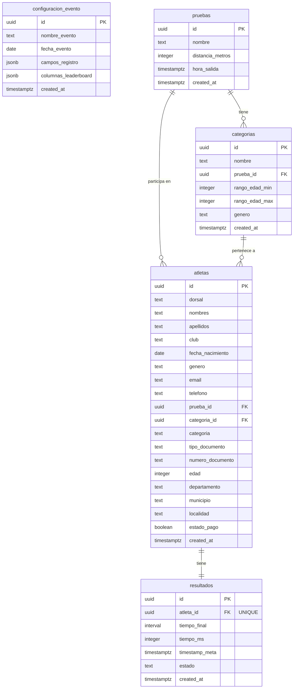

# Documentación Técnica - Base de Datos del Sistema de Resultados Deportivos

## Descripción General

Sistema de gestión de resultados para eventos deportivos (carreras, competencias, etc.) que permite registrar atletas, gestionar categorías, pruebas y almacenar resultados con tiempos precisos.

## Arquitectura de Datos

### Diagrama de Relaciones



## Descripción Detallada de Tablas

### 1. configuracion_evento

**Propósito:** Almacena la configuración general de eventos deportivos.

| Campo | Tipo | Descripción | Restricciones |
|-------|------|-------------|---------------|
| `id` | UUID | Identificador único | PK, DEFAULT uuid_generate_v4() |
| `nombre_evento` | TEXT | Nombre del evento | NOT NULL |
| `fecha_evento` | DATE | Fecha de realización | NULLABLE |
| `campos_registro` | JSONB | Configuración de campos visibles en formulario | DEFAULT '{"club": true, "email": true, "dorsal": true, "telefono": false}' |
| `columnas_leaderboard` | JSONB | Columnas a mostrar en clasificación | DEFAULT '["posicion", "dorsal", "nombre", "tiempo", "categoria"]' |
| `created_at` | TIMESTAMPTZ | Fecha de creación | DEFAULT NOW() |

**Ejemplo de uso:**
```sql
INSERT INTO configuracion_evento (nombre_evento, fecha_evento) 
VALUES ('Maratón de Barranquilla 2026', '2026-03-15');
```

---

### 2. pruebas

**Propósito:** Define las pruebas o competencias disponibles (5K, 10K, Media Maratón, etc.).

| Campo | Tipo | Descripción | Restricciones |
|-------|------|-------------|---------------|
| `id` | UUID | Identificador único | PK, DEFAULT uuid_generate_v4() |
| `nombre` | TEXT | Nombre de la prueba | NOT NULL |
| `distancia_metros` | INTEGER | Distancia en metros | NULLABLE |
| `hora_salida` | TIMESTAMPTZ | Hora de inicio | NULLABLE |
| `created_at` | TIMESTAMPTZ | Fecha de creación | DEFAULT NOW() |

**Ejemplo de uso:**
```sql
INSERT INTO pruebas (nombre, distancia_metros, hora_salida) 
VALUES ('5K Recreativa', 5000, '2026-03-15 07:00:00-05');
```

---

### 3. categorias

**Propósito:** Categorías de competencia por edad y género (Elite, Novatos, Master, etc.).

| Campo | Tipo | Descripción | Restricciones |
|-------|------|-------------|---------------|
| `id` | UUID | Identificador único | PK, DEFAULT uuid_generate_v4() |
| `nombre` | TEXT | Nombre de la categoría | NOT NULL |
| `prueba_id` | UUID | Referencia a prueba | FK → pruebas(id) ON DELETE CASCADE |
| `rango_edad_min` | INTEGER | Edad mínima | NULLABLE |
| `rango_edad_max` | INTEGER | Edad máxima | NULLABLE |
| `genero` | TEXT | Género de la categoría | CHECK IN ('M', 'F', 'Mixto') |
| `created_at` | TIMESTAMPTZ | Fecha de creación | DEFAULT NOW() |

**Índices:**
- `idx_categorias_prueba` en `prueba_id`

**Ejemplo de uso:**
```sql
INSERT INTO categorias (nombre, prueba_id, rango_edad_min, rango_edad_max, genero) 
VALUES ('Elite Masculino', '<prueba_id>', 18, 39, 'M');
```

---

### 4. atletas

**Propósito:** Registro completo de participantes en eventos deportivos.

| Campo | Tipo | Descripción | Restricciones |
|-------|------|-------------|---------------|
| `id` | UUID | Identificador único | PK, DEFAULT uuid_generate_v4() |
| `dorsal` | TEXT | Número de dorsal | NOT NULL |
| `nombres` | TEXT | Nombres del atleta | NOT NULL |
| `apellidos` | TEXT | Apellidos del atleta | NOT NULL |
| `club` | TEXT | Club deportivo | NULLABLE |
| `fecha_nacimiento` | DATE | Fecha de nacimiento | NULLABLE |
| `genero` | TEXT | Género | CHECK IN ('M', 'F') |
| `email` | TEXT | Correo electrónico | NULLABLE |
| `telefono` | TEXT | Teléfono de contacto | NULLABLE |
| `prueba_id` | UUID | Prueba inscrita | FK → pruebas(id) ON DELETE SET NULL |
| `categoria_id` | UUID | Categoría asignada | FK → categorias(id) ON DELETE SET NULL |
| `categoria` | TEXT | Categoría (texto libre) | NULLABLE |
| `tipo_documento` | TEXT | Tipo de documento (CC, TI, etc.) | NULLABLE |
| `numero_documento` | TEXT | Número de documento | NULLABLE |
| `edad` | INTEGER | Edad del atleta | NULLABLE |
| `departamento` | TEXT | Departamento de residencia | NULLABLE |
| `municipio` | TEXT | Municipio de residencia | NULLABLE |
| `localidad` | TEXT | Localidad de residencia | NULLABLE |
| `estado_pago` | BOOLEAN | Estado de pago de inscripción | DEFAULT FALSE |
| `created_at` | TIMESTAMPTZ | Fecha de registro | DEFAULT NOW() |

**Índices:**
- `idx_atletas_dorsal` en `dorsal`
- `idx_atletas_categoria` en `categoria`
- `idx_atletas_genero` en `genero`
- `idx_atletas_prueba` en `prueba_id`
- `idx_atletas_numero_documento` en `numero_documento`

**Ejemplo de uso:**
```sql
INSERT INTO atletas (dorsal, nombres, apellidos, genero, categoria, tipo_documento, numero_documento) 
VALUES ('001', 'Juan', 'Pérez', 'M', 'Elite', 'CC', '1234567890');
```

---

### 5. resultados

**Propósito:** Almacena tiempos y resultados de cada atleta.

| Campo | Tipo | Descripción | Restricciones |
|-------|------|-------------|---------------|
| `id` | UUID | Identificador único | PK, DEFAULT uuid_generate_v4() |
| `atleta_id` | UUID | Referencia al atleta | FK → atletas(id) ON DELETE CASCADE, UNIQUE |
| `tiempo_final` | INTERVAL | Tiempo en formato HH:MM:SS.ms | NULLABLE |
| `tiempo_ms` | INTEGER | Tiempo en milisegundos | NULLABLE |
| `timestamp_meta` | TIMESTAMPTZ | Marca de tiempo al cruzar meta | NULLABLE |
| `estado` | TEXT | Estado del resultado | DEFAULT 'finalizado' |
| `created_at` | TIMESTAMPTZ | Fecha de creación | DEFAULT NOW() |

**Índices:**
- `idx_resultados_atleta` en `atleta_id`
- `idx_resultados_tiempo_ms` en `tiempo_ms`
- `idx_resultados_estado` en `estado`

**Notas importantes:**
- Relación 1:1 con atletas (UNIQUE en `atleta_id`)
- `tiempo_ms` se usa para ordenamiento eficiente
- Estados posibles: 'finalizado', 'descalificado', 'DNS' (Did Not Start), 'DNF' (Did Not Finish)

**Ejemplo de uso:**
```sql
INSERT INTO resultados (atleta_id, tiempo_final, tiempo_ms, timestamp_meta, estado) 
VALUES ('<atleta_id>', '00:25:30.45', 1530450, NOW(), 'finalizado');
```

## Vistas Predefinidas

### v_ranking_completo

Ranking general de todos los atletas ordenados por tiempo.

```sql
SELECT * FROM v_ranking_completo LIMIT 10;
```

**Columnas:** posicion, dorsal, nombres, apellidos, genero, categoria, club, departamento, municipio, tiempo_final, tiempo_ms, timestamp_meta, estado

### v_ranking_por_categoria

Ranking agrupado por categoría con posición relativa.

```sql
SELECT * FROM v_ranking_por_categoria WHERE categoria = 'Elite';
```

**Columnas:** categoria, posicion_categoria, dorsal, nombres, apellidos, genero, tiempo_final, tiempo_ms

### v_estadisticas_evento

Estadísticas generales del evento.

```sql
SELECT * FROM v_estadisticas_evento;
```

**Columnas:** total_atletas, total_finalizados, total_hombres, total_mujeres, total_categorias, mejor_tiempo_ms, tiempo_promedio_ms, peor_tiempo_ms

## Consultas Comunes

### Top 10 mejores tiempos
```sql
SELECT 
    ROW_NUMBER() OVER (ORDER BY tiempo_ms) as posicion,
    dorsal,
    nombres || ' ' || apellidos as nombre_completo,
    categoria,
    tiempo_final
FROM atletas a
INNER JOIN resultados r ON a.id = r.atleta_id
WHERE r.tiempo_ms > 0
ORDER BY r.tiempo_ms
LIMIT 10;
```

### Atletas por categoría
```sql
SELECT 
    categoria,
    COUNT(*) as total_atletas,
    COUNT(CASE WHEN genero = 'M' THEN 1 END) as hombres,
    COUNT(CASE WHEN genero = 'F' THEN 1 END) as mujeres
FROM atletas
WHERE categoria IS NOT NULL
GROUP BY categoria
ORDER BY categoria;
```

### Atletas sin resultado
```sql
SELECT 
    a.dorsal,
    a.nombres,
    a.apellidos,
    a.categoria
FROM atletas a
LEFT JOIN resultados r ON a.id = r.atleta_id
WHERE r.id IS NULL
ORDER BY a.dorsal;
```

### Mejor tiempo por categoría y género
```sql
SELECT 
    a.categoria,
    a.genero,
    MIN(r.tiempo_final) as mejor_tiempo,
    MIN(r.tiempo_ms) as mejor_tiempo_ms
FROM atletas a
INNER JOIN resultados r ON a.id = r.atleta_id
WHERE r.tiempo_ms > 0 AND a.categoria IS NOT NULL
GROUP BY a.categoria, a.genero
ORDER BY a.categoria, a.genero;
```

## Optimizaciones y Rendimiento

### Índices Implementados

1. **Búsquedas por dorsal:** Índice en `atletas.dorsal` para búsquedas rápidas
2. **Filtrado por categoría:** Índice en `atletas.categoria`
3. **Ordenamiento por tiempo:** Índice en `resultados.tiempo_ms`
4. **Búsquedas por documento:** Índice en `atletas.numero_documento`

### Recomendaciones

- Usar `tiempo_ms` en lugar de `tiempo_final` para ordenamientos
- Las vistas predefinidas ya están optimizadas para consultas frecuentes
- Para reportes grandes, considerar materializar las vistas

## Seguridad y Políticas RLS

> [!WARNING]
> **Row Level Security (RLS) está deshabilitado** en todas las tablas. Si se requiere seguridad a nivel de fila, se debe habilitar RLS y crear políticas apropiadas.

### Ejemplo de habilitación de RLS:
```sql
ALTER TABLE atletas ENABLE ROW LEVEL SECURITY;

CREATE POLICY "Usuarios pueden ver todos los atletas"
ON atletas FOR SELECT
TO PUBLIC
USING (true);
```

## Mantenimiento

### Backup
```bash
pg_dump -U postgres resultados_deportivos > backup_$(date +%Y%m%d).sql
```

### Restauración
```bash
psql -U postgres resultados_deportivos < backup_20260120.sql
```

### Limpieza de datos de prueba
```sql
-- CUIDADO: Esto eliminará TODOS los datos
TRUNCATE TABLE resultados CASCADE;
TRUNCATE TABLE atletas CASCADE;
TRUNCATE TABLE categorias CASCADE;
TRUNCATE TABLE pruebas CASCADE;
TRUNCATE TABLE configuracion_evento CASCADE;
```

## Migración desde Supabase

Este esquema es compatible con Supabase. Para migrar:

1. Exportar datos desde Supabase usando los scripts proporcionados
2. Ejecutar `setup_local.sql` en PostgreSQL local
3. Actualizar `config.js` para apuntar a PostgreSQL local
4. Verificar la conexión y funcionalidad

## Versión y Changelog

- **v1.0** (2026-01-20): Versión inicial con 5 tablas, 3 vistas y 9 índices
